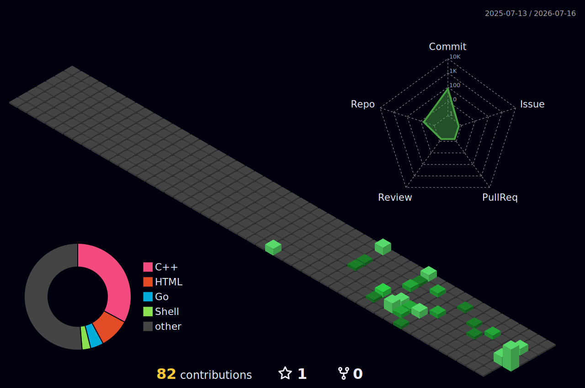

# Hi there, I'm Mohammed Al-Badiah

<code>cloud/devops</code> · <code>homelab builder</code> · <code>riyadh, sa</code>

###

Cybersecurity student by degree, Cloud/DevOps engineer by passion. I build infrastructure that scales, break things in homelabs, and lift heavy in the gym.

###

  
  
  
  
  
  
  
  
  
  
  
  
  
  
  
  
  
  
  
  
  
  
  
  
  
  
  
  
  

###

  
  
  

###

### Certifications

| Certificate | Issuer |
|:--|:--|
| AWS Cloud Technical Essentials | Coursera (AWS) |
| IBM Relational Database Administration | Coursera (IBM) |
| C++ Object-Oriented Data Structures | Coursera (UIUC) |
| SQL for Data Science | Coursera (UMich) |

**Roadmap:** `AWS SAA-C03` → `CKA` → `Terraform Associate` → `DOP-C02` → `SOA-C02`

###

### Projects

| Project | Description | Stack |
|:--------|:-----------|:------|
| [**Portfolio**](https://mhammdalbadiah.github.io) | Terminal-aesthetic personal site with interactive CLI | HTML / CSS / JS |
| **Homelab** | Proxmox cluster + Kubernetes + NAS on Raspberry Pi | Proxmox / Tailscale / Pi 5 |
| **imgs2pdf** | CLI tool to merge images into a single PDF | Python / Pillow |
| **Airline System** | Linked Lists, Stacks and Queues management system | C++ / Makefile |
| **Arabic Jeopardy** | Two-team quiz game with Gulf cultural content | Claude API / JS |

###

### Stats

  

  
  

  
  

###

### 3D Contributions

  

###

  

